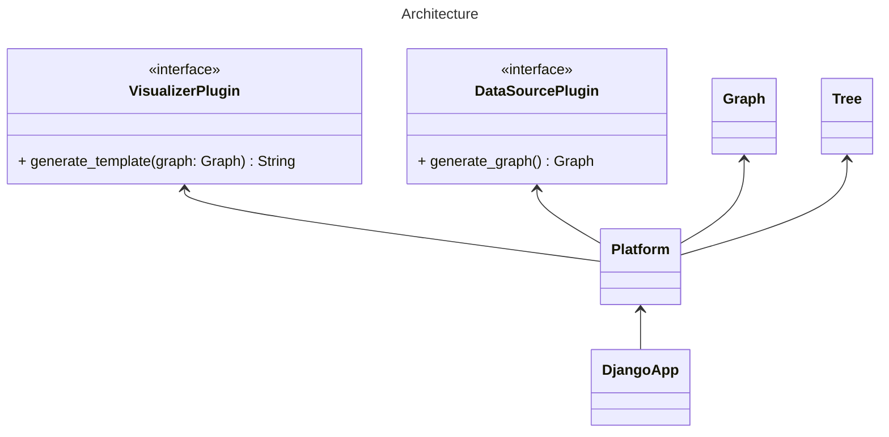
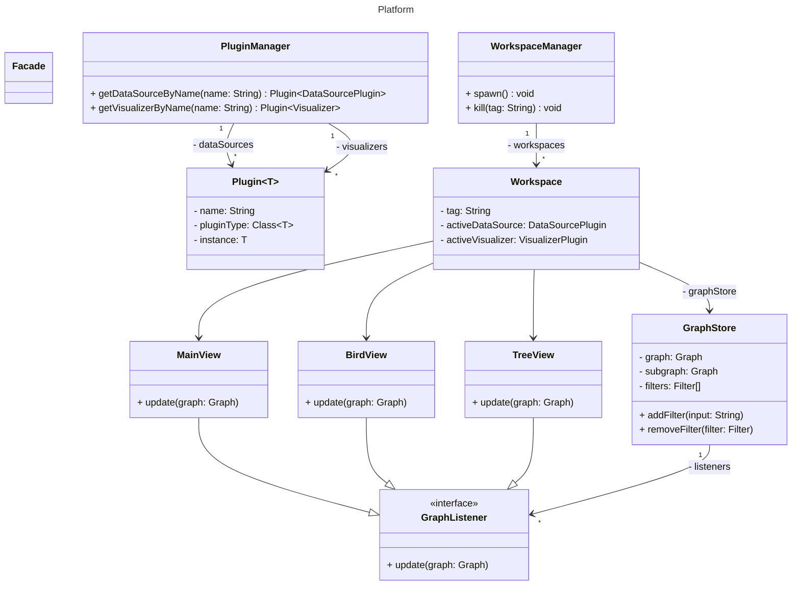

# Graph-Visualizer  
SV 18/2021 Nikola Mitrović  
SV 27/2021 Vladislav Radović  
SV 58/2021 Aleksa Janjić  
SV 61/2021 Bojan Živanić

## Setup
Clone repo and then run `pip install -e ./graph_visualizer_api -e ./graph_visualizer_platform -e ./graph_visualizer_core`.

To start the django server, run `gv-manage runserver`.

## Project structure
The project consists of three main directories:
1. `graph_visualizer_api` - The API of the app containing interfaces and the graph model.
2. `graph_visualizer_platform` - This is the app platform that relies on the API and coordinates communication between the data source and visualizer.
3. `graph_visualizer_core` - This is the Django app that serves as a client and relies on the platform. It presents all the data being formed by the platform.

